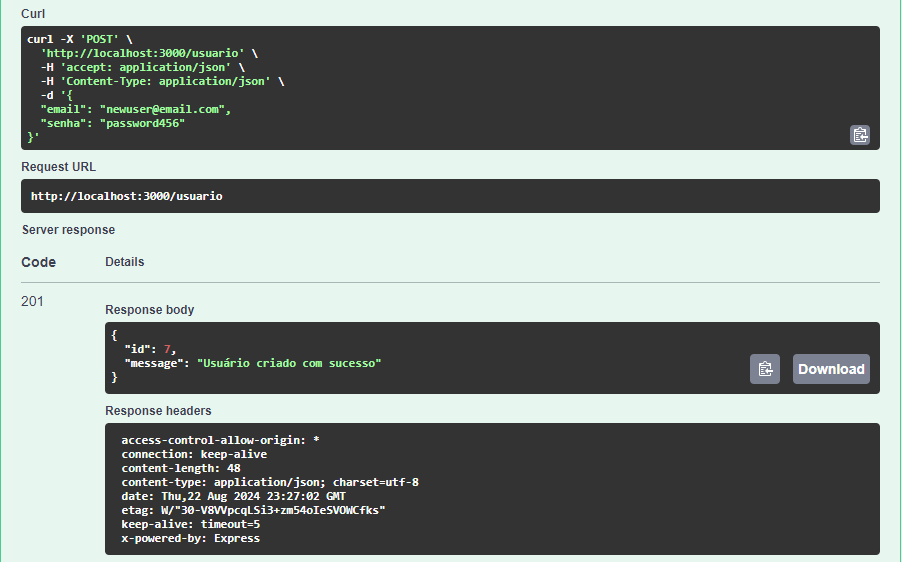

# Documentação da API

A documentação da API está disponível através do Swagger UI em [http://localhost:3000/api-docs](http://localhost:3000/api-docs).

## Exemplos de Endpoints

### POST /usuario

**Descrição:** Cria um novo usuário.

**Request Body:**
```json
{
  "email": "user@example.com",
  "senha": "password123"
}
```

**Exemplo:** teste de POST /usuario.


